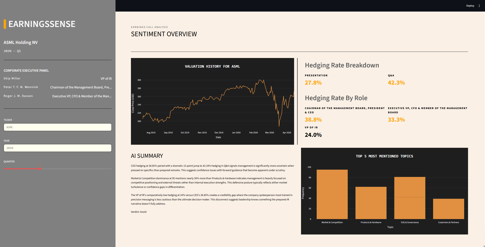

<h1> ▌EARNINGSSENSE — Analysing Executive Speech</h1>
     

<h2>Overview</h2>

<strong>EARNINGSSENSE</strong> prompts the user to select:

<ul>
  <li>a company</li>
  <li>a financial year</li>
  <li>a quarter of that financial year</li>
</ul>

The app then presents an analysis of the <b>natural language</b> of the company's executive panel.

<ul>
  <li>It highlights the frequency of hedging for each person, as well as the most common broad topics mentioned</li>
  <li>A stock chart is also shown to give users an idea of how the company is performing in the quarters leading up to the call.</li>
  <li>An <b>AI powered summary</b> where the earnings call analysis is passed as context to <b>Claude Haiku</b> via the Anthropic API.</li>
</ul>
<h2>Example demonstration</h2>

The dashboard shows the analysis of the earnings call corresponding to the second quarter of the 2020 financial year for the semiconductor company ASML.

The user views:

<ul>
  <li>The exact names and roles of the executive panel members.</li>
  <li>Hedging rate separated by <b>executive member</b> and by <b>call section (presentation vs Q&A)</b>.</li>
  <li>An <b>AI powered summary</b> which gives a recommendation to the user on whether to invest, acting as a financial analyst and earnings call language expert.</li>
  <li>The top 5 most mentioned topics in the earnings call. This gives an idea of what the company is currently focused on.</li>
</ul>
<h2>Installation</h2>

<pre><code>git clone https://github.com/aydinkhan2005/earnings-call-analyser.git
cd earnings-call-analyser
pip install -r requirements.txt
streamlit run app/app.py
</code></pre>
<h2>Process From User Input To Output</h2>
 

 

  <table>
    <tr>
      <td>🟨 Dashboard UI & Output</td>
      <td>🟪 Data / NLP</td>
      <td>🟦 ML models</td>
    </tr>
  </table>

<h2>Training the Classifiers</h2>

Training the Logistic Regression models required two labelled datasets.

<ul>
  <li>Dataset 1 was for training the hedging model. This was a <b>binary classification</b> problem where 1 would denote hedging and 0 otherwise.</li>
  <li>Dataset 2 was for training the topic classification model. This was a <b>multi class classifiaction</b>problem ranging from topic 1 through to topic 11.</li>
</ul>
<h3>The problem</h3>
<ul>
  <li>No pre-labelled dataset existed for our purposes so we had to create one by splitting our 57000 (approx.) sentences worth of transcript data into a train and test set.</li>
  <li>Each sentence was then labelled (0-1 for hedging, 1-11 for topic) by <b>Claude Haiku</b> via the <b>Anthropic API</b>.</li>
</ul>
<h3>The API costs</h3>
<ul>
  <li>The <b>brute force sequential method</b> of sending one API request at a time yielded a proecssing time of <b>approximatley 8 minutes per transcript</b>.</li>
  <li>Applied to all transcripts available, this would have taken an approximate <b>25 hours</b> and around <b>$30</b> to label the entire dataset with binary hedging labels alone.</li>
</ul>
<h3>Solution to the API costs</h3>
<ul>
  <li>We sent each API request, asking Claude to label 10 sentences at a time rather than one.</li>
  <li>Using <code>asyncio</code>, we were able to send about <b>10 concurrent requests</b>.</li>
  <li>As a result, we reduced the binary labelling time <b>from 8 minutes to about 5-7 seconds</b> per transcript.</li>
  <li>Total binary labelling for the entire set of 171 transcripts took only <b>3 hours</b> compared to the <b>estimated 25 hours</b> before.</li>
  <li>Total labelling costs for creating the hedged sentences dataset took <b>$4.24</b>, a significant decrease from the estimated <b>$30</b>.</li>
</ul>

This same concurrency and batching system was used for creating the topic dataset but slightly more costly due to the multi-class labels.

<h2>Performance of the Classifiers</h2>
<h3>Hedging Classifier</h3>

📊 View Classification Report

 
<table>
  <thead>
    <tr>
      <th>Class</th>
      <th>Precision</th>
      <th>Recall</th>
      <th>F1-Score</th>
      <th>Support</th>
    </tr>
  </thead>
  <tbody>
    <tr><td>Not hedging (0)</td><td>0.91</td><td>0.86</td><td>0.89</td><td>7,969</td></tr>
    <tr><td>Hedging (1)</td><td>0.77</td><td>0.84</td><td>0.80</td><td>4,228</td></tr>
    <tr><td><b>Accuracy</b></td><td></td><td></td><td><b>0.86</b></td><td><b>12,197</b></td></tr>
    <tr><td>Macro avg</td><td>0.84</td><td>0.85</td><td>0.85</td><td>12,197</td></tr>
    <tr><td>Weighted avg</td><td>0.86</td><td>0.86</td><td>0.86</td><td>12,197</td></tr>
  </tbody>
</table>

<blockquote>The classifier performs strongly on the majority class (not hedging) with an F1 of 0.89. Performance on the hedging class is slightly lower at 0.80, which is expected given the class imbalance — hedging sentences account for roughly 35% of the dataset. Overall accuracy of 0.86 represents a solid baseline for a logistic regression model on financial text.</blockquote>

<h3>Topic Classifier</h3>

  
📊 View Classification Report

   
<table>
  <thead>
    <tr>
      <th>Topic</th>
      <th>Label</th>
      <th>Precision</th>
      <th>Recall</th>
      <th>F1-Score</th>
      <th>Support</th>
    </tr>
  </thead>
  <tbody>
    <tr><td>1</td><td>Financial performance</td><td>0.88</td><td>0.72</td><td>0.79</td><td>2,452</td></tr>
    <tr><td>2</td><td>Products & hardware</td><td>0.67</td><td>0.59</td><td>0.62</td><td>1,166</td></tr>
    <tr><td>3</td><td>Cloud & infrastructure</td><td>0.56</td><td>0.64</td><td>0.60</td><td>487</td></tr>
    <tr><td>4</td><td>AI & software</td><td>0.59</td><td>0.65</td><td>0.62</td><td>718</td></tr>
    <tr><td>5</td><td>Supply chain & ops</td><td>0.57</td><td>0.67</td><td>0.61</td><td>691</td></tr>
    <tr><td>6</td><td>Market & competition</td><td>0.38</td><td>0.52</td><td>0.44</td><td>393</td></tr>
    <tr><td>7</td><td>R&D & innovation</td><td>0.44</td><td>0.58</td><td>0.50</td><td>441</td></tr>
    <tr><td>8</td><td>Macro & geopolitics</td><td>0.43</td><td>0.62</td><td>0.51</td><td>300</td></tr>
    <tr><td>9</td><td>Customers & partners</td><td>0.71</td><td>0.63</td><td>0.66</td><td>1,105</td></tr>
    <tr><td>10</td><td>ESG & governance</td><td>0.44</td><td>0.57</td><td>0.49</td><td>171</td></tr>
    <tr><td>11</td><td>Junk / non-substantive</td><td>—</td><td>—</td><td>—</td><td>—</td></tr>
    <tr><td><b>Accuracy</b></td><td></td><td></td><td></td><td><b>0.65</b></td><td><b>7,924</b></td></tr>
    <tr><td>Macro avg</td><td></td><td>0.57</td><td>0.62</td><td>0.59</td><td>7,924</td></tr>
    <tr><td>Weighted avg</td><td></td><td>0.68</td><td>0.65</td><td>0.66</td><td>7,924</td></tr>
  </tbody>
</table>
<blockquote>
Overall accuracy of 0.65 across 11 classes represents a meaningful result above random chance (~9%). The classifier performs strongest on <b>Financial performance</b> (F1: 0.79) and <b>Customers & partners</b> (F1: 0.66), likely reflecting the high volume and consistent language of these topics in earnings calls. Performance is weakest on <b>Market & competition</b> (F1: 0.44) and <b>R&D & innovation</b> (F1: 0.50), where topic boundaries are more semantically ambiguous. ESG & governance also scores poorly, which is unsurprising given its low support of just 171 sentences — the model has comparatively little training data for this class. As noted in the limitations section, this classifier represents a TF-IDF baseline and is a strong candidate for improvement with a domain-specific language model such as FinBERT.
</blockquote>
  

<h2>Limitations 📌</h2>
<ul>
  <li><b>LLM-dependent ground truth</b> — The labelled datasets were constructed using Claude Haiku as the annotation source, treating its outputs as ground truth. Label quality is therefore contingent on the model used; a different LLM or human annotator may produce systematically different labels, which would in turn affect classifier behaviour.</li>

  <li><b>Thomson Reuters format dependency</b> — The transcript parser assumes the Thomson Reuters transcript format. Apple transcripts, which follow a different structure, were excluded as building a separate parser for a single company was not deemed worthwhile. Any transcripts outside the Thomson Reuters format are incompatible with the pipeline.</li>

  <li><b>Limited data range</b> — As a consequence of the format dependency above, available data is restricted to the period 2016–2020. The pipeline cannot be trivially extended to more recent transcripts without access to additional Thomson Reuters formatted data.</li>

  <li><b>Narrow sector coverage</b> — The dashboard covers 10 companies, predominantly from the technology and semiconductor sectors (e.g. NVDA, AMD, ASML, INTC, AMZN). Hedging language and topic distributions may differ substantially across other industries such as healthcare or automotive, meaning classifier performance may degrade outside this domain.</li>

  <li><b>Model simplicity</b> — Both classifiers use logistic regression, which may not capture the full complexity of financial language and hedging patterns. More expressive models such as fine-tuned BERT variants could yield improved performance, particularly on ambiguous sentences.</li>

  <li><b>High junk sentence rate</b> — Approximately 20–25% of sentences were assigned to the junk topic class, reflecting the natural structure of earnings calls which contain considerable procedural and non-substantive language. This is an inherent limitation of the domain rather than a modelling failure.</li>
</ul>
<h2>Future Work</h2>
<ul>
  <li><b>Improved topic classification</b> — The current topic classifier uses TF-IDF features with logistic regression as an initial baseline. Future iterations could explore domain-specific language models such as FinBERT, which is pretrained on financial text and may better capture the semantic nuance of earnings call discourse, likely improving on the current 0.66 accuracy.</li>

  <li><b>Expanded transcript coverage</b> — The pipeline is currently constrained to Thomson Reuters formatted transcripts from 2016–2020. Extending support to additional transcript formats would unlock a broader and more recent dataset, improving both model training and the relevance of the dashboard.</li>

  <li><b>Broader sector representation</b> — The current dataset is heavily weighted towards technology and semiconductor companies. Incorporating transcripts from healthcare, automotive, financial services, and other sectors would improve the generalisability of both classifiers beyond the tech domain.</li>

  <li><b>Human validation of LLM-generated labels</b> — A proportion of the Claude Haiku-generated labels could be spot-checked against human annotators to quantify label reliability and identify any systematic biases in the ground truth, strengthening confidence in the training data.</li>

  <li><b>Live data pipeline</b> — The current system relies on a static corpus of transcripts. Integrating a live earnings call feed would allow the dashboard to analyse new transcripts in real time as companies report quarterly results.</li>

  <li><b>Analyst sentiment analysis</b> — The current pipeline filters out analyst questions and only analyses executive sentences. Incorporating analyst sentiment as an additional signal could provide a richer picture of market perception during earnings calls.</li>
</ul>
<h2>Data Sources</h2>
Earnings call transcripts sourced from Earnings Calls Transcripts - NASDAQ - 2016-2020 on Kaggle.
Originally from Thomson Reuters. See data/LICENSE for full license details.
